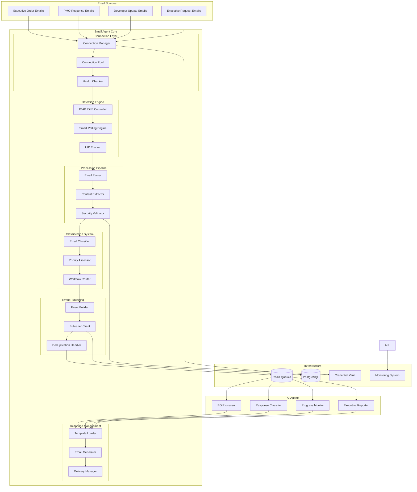

# Email Agent Design Document

## Overview

The Email Agent is a federal-grade email processing system that serves as the foundational component of the U.S. Department of Labor's Email-Driven AI Task Management System. The system monitors multiple GoDaddy email accounts, processes incoming emails with security validation, classifies them by workflow type, and publishes standardized events to message queues for downstream AI agent consumption.

The design builds upon the existing EmailClient abstraction and GoDaddyEmailClient implementation, extending it to meet federal compliance requirements, high-availability operations, and enterprise-scale performance needs.

### Key Design Principles

- **Federal Security First**: All components implement government-grade security controls
- **High Availability**: 99.9% uptime with automatic failover and recovery
- **Scalable Architecture**: Horizontal scaling support for increased email volumes
- **Event-Driven Design**: Asynchronous processing with reliable message queuing
- **Audit Compliance**: Complete traceability and immutable audit logging
- **Modular Components**: Loosely coupled services for maintainability

## Architecture

### System Architecture Overview



### Layered Architecture Design

The system follows an 8-layer architecture as specified in the original requirements:

1. **Foundation Infrastructure** - Configuration, credentials, external interfaces
2. **Connection Management** - IMAP/SMTP connection handling and pooling
3. **Email Detection Engine** - Real-time email monitoring and detection
4. **Email Processing Pipeline** - Content extraction and validation
5. **Email Classification System** - Intelligent email categorization
6. **Event Publishing Infrastructure** - Reliable event distribution
7. **Response Management System** - Outbound email generation
8. **Monitoring and Operations** - Health monitoring and performance tracking

## Components and Interfaces

### Layer 1: Foundation Infrastructure

#### Environment Configuration Manager
```python
class ConfigurationManager:
    def load_environment_config(self, environment: str) -> Dict[str, Any]
    def validate_configuration(self, config: Dict[str, Any]) -> bool
    def get_email_account_config(self, account_type: str) -> EmailAccountConfig
    def reload_configuration(self) -> None
```

**Purpose**: Centralized configuration management with environment-specific settings
**Key Features**: 
- Environment validation (dev/staging/production)
- Hot configuration reloading
- Configuration schema validation

#### Credential Security Manager
```python
class CredentialManager:
    def encrypt_credentials(self, credentials: Dict[str, str]) -> str
    def decrypt_credentials(self, encrypted_data: str) -> Dict[str, str]
    def rotate_credentials(self, account_id: str) -> None
    def validate_credential_strength(self, password: str) -> bool
```

**Purpose**: AES-256 encryption for credential storage and management
**Key Features**:
- Automatic credential rotation
- Secure key derivation
- Credential strength validation

#### Database Interface Manager
```python
class DatabaseManager:
    def get_connection(self) -> Connection
    def execute_query(self, query: str, params: Dict) -> Result
    def create_audit_entry(self, event: AuditEvent) -> None
    def get_email_processing_state(self, email_uid: str) -> ProcessingState
```

**Purpose**: PostgreSQL interface with connection pooling and audit logging
**Key Features**:
- Connection pooling with health checks
- Immutable audit log entries with cryptographic signing
- Automatic failover to backup database

### Layer 2: Connection Management

#### Enhanced GoDaddy Email Client
```python
class EnhancedGoDaddyEmailClient(EmailClient):
    def __init__(self, config: EmailAccountConfig, credential_manager: CredentialManager)
    def connect_with_retry(self, max_retries: int = 3) -> None
    def detect_server_capabilities(self) -> ServerCapabilities
    def get_connection_health(self) -> ConnectionHealth
    def handle_rate_limiting(self, retry_after: int) -> None
```

**Enhancements over existing client**:
- Server capability detection and caching
- Rate limiting detection and adaptive backoff
- Connection health monitoring
- Automatic reconnection with exponential backoff

#### Connection Pool Manager
```python
class ConnectionPoolManager:
    def get_connection(self, account_id: str) -> EmailConnection
    def return_connection(self, connection: EmailConnection) -> None
    def monitor_pool_health(self) -> PoolHealth
    def scale_pool_size(self, target_size: int) -> None
```

**Purpose**: Multi-connection pooling for high availability
**Key Features**:
- Dynamic pool sizing based on load
- Connection health validation
- Automatic connection replacement

### Layer 3: Email Detection Engine

#### IMAP IDLE Controller
```python
class IMAPIdleController:
    def start_idle_session(self, connection: IMAPConnection) -> IdleSession
    def handle_idle_response(self, response: IdleResponse) -> List[EmailUID]
    def renew_idle_session(self, session: IdleSession) -> None
    def fallback_to_polling(self, reason: str) -> None
```

**Purpose**: Real-time email detection using IMAP IDLE protocol
**Key Features**:
- Automatic session renewal before timeout
- Graceful fallback to polling when IDLE fails
- Multi-account IDLE session management

#### Smart Polling Engine
```python
class SmartPollingEngine:
    def start_adaptive_polling(self, account_id: str) -> None
    def adjust_polling_interval(self, email_frequency: float) -> None
    def detect_optimal_interval(self, historical_data: List[EmailEvent]) -> int
    def handle_rate_limit_backoff(self, backoff_time: int) -> None
```

**Purpose**: Intelligent fallback polling with adaptive intervals
**Key Features**:
- Machine learning-based interval optimization
- Rate limit detection and automatic adjustment
- Historical pattern analysis for optimal timing

### Layer 4: Email Processing Pipeline

#### Security Validator
```python
class EmailSecurityValidator:
    def validate_sender_authorization(self, sender: str) -> AuthorizationResult
    def scan_attachments_for_threats(self, attachments: List[Attachment]) -> ScanResult
    def validate_content_safety(self, content: str) -> SafetyResult
    def check_digital_signatures(self, email: EmailMessage) -> SignatureResult
```

**Purpose**: Government-grade security validation for all email content
**Key Features**:
- Government domain whitelist validation
- Integrated antivirus scanning
- Digital signature verification
- Content safety analysis

#### Enhanced Content Extractor
```python
class EnhancedContentExtractor:
    def extract_email_headers(self, email: EmailMessage) -> EmailHeaders
    def extract_clean_text_content(self, email: EmailMessage) -> str
    def extract_and_validate_attachments(self, email: EmailMessage) -> List[ValidatedAttachment]
    def analyze_email_threading(self, email: EmailMessage) -> ThreadAnalysis
```

**Enhancements over existing extractor**:
- Thread relationship analysis
- Content sanitization and validation
- Structured metadata extraction
- Attachment security validation

### Layer 5: Email Classification System

#### Multi-Factor Email Classifier
```python
class EmailClassifier:
    def classify_email(self, email: ProcessedEmail) -> ClassificationResult
    def calculate_confidence_score(self, features: EmailFeatures) -> float
    def validate_classification_accuracy(self, classification: Classification) -> bool
    def handle_ambiguous_classification(self, email: ProcessedEmail) -> AmbiguousResult
```

**Purpose**: Accurate email type identification with confidence scoring
**Key Features**:
- Multi-factor analysis (sender, subject, content, attachments)
- Machine learning-based classification with 95% accuracy target
- Confidence scoring with manual review triggers
- Ambiguous email handling

#### Workflow Router
```python
class WorkflowRouter:
    def determine_workflow(self, classification: Classification) -> WorkflowType
    def assign_priority_level(self, email: ProcessedEmail) -> PriorityLevel
    def route_to_queue(self, workflow: WorkflowType) -> QueueName
    def handle_high_priority_escalation(self, email: ProcessedEmail) -> None
```

**Purpose**: Intelligent workflow determination and priority assignment
**Key Features**:
- Priority-based routing
- Executive request escalation
- Load balancing across queues

### Layer 6: Event Publishing Infrastructure

#### Standardized Event Builder
```python
class EventBuilder:
    def build_email_event(self, processed_email: ProcessedEmail) -> StandardizedEvent
    def add_correlation_id(self, event: StandardizedEvent) -> StandardizedEvent
    def validate_event_schema(self, event: StandardizedEvent) -> bool
    def add_security_metadata(self, event: StandardizedEvent) -> StandardizedEvent
```

**Event Schema Structure**:
```json
{
  "event_id": "uuid",
  "correlation_id": "uuid",
  "timestamp": "ISO8601",
  "event_type": "NEW_EO|PMO_RESPONSE|DEVELOPER_UPDATE|EXECUTIVE_REQUEST",
  "priority": "HIGH|MEDIUM|LOW",
  "confidence_score": 0.95,
  "email_metadata": {
    "uid": "string",
    "message_id": "string",
    "sender": "string",
    "subject": "string",
    "received_date": "ISO8601",
    "thread_id": "string"
  },
  "content": {
    "body_text": "string",
    "attachments": [],
    "classification_features": {}
  },
  "security": {
    "sender_authorized": true,
    "content_safe": true,
    "attachments_scanned": true
  },
  "workflow": {
    "assigned_queue": "string",
    "processing_requirements": {}
  }
}
```

#### Multi-Layer Deduplication Handler
```python
class DeduplicationHandler:
    def check_uid_duplicate(self, uid: str) -> bool
    def check_message_id_duplicate(self, message_id: str) -> bool
    def check_content_hash_duplicate(self, content_hash: str) -> bool
    def mark_as_processed(self, email_identifiers: EmailIdentifiers) -> None
```

**Purpose**: 99.99% accurate duplicate prevention across multiple layers
**Key Features**:
- UID-based tracking in Redis cache
- Message-ID comparison in database
- SHA-256 content hash verification
- Cross-layer validation

### Layer 7: Response Management System

#### Template-Based Email Generator
```python
class EmailGenerator:
    def load_template(self, template_type: str) -> EmailTemplate
    def render_email(self, template: EmailTemplate, context: Dict) -> RenderedEmail
    def generate_task_assignment(self, task_data: TaskData) -> TaskAssignmentEmail
    def generate_pmo_approval_request(self, approval_data: ApprovalData) -> ApprovalEmail
    def generate_executive_summary(self, summary_data: SummaryData) -> SummaryEmail
```

**Purpose**: Automated email generation with professional templates
**Key Features**:
- Government-compliant email templates
- Dynamic content rendering
- Multi-format support (HTML/text)
- Personalization and localization

#### Delivery Manager with Tracking
```python
class DeliveryManager:
    def send_email_with_tracking(self, email: RenderedEmail) -> DeliveryResult
    def track_delivery_status(self, delivery_id: str) -> DeliveryStatus
    def handle_delivery_failures(self, failed_delivery: FailedDelivery) -> None
    def retry_failed_deliveries(self) -> List[RetryResult]
```

**Purpose**: Reliable email delivery with comprehensive tracking
**Key Features**:
- Delivery confirmation tracking
- Automatic retry with exponential backoff
- Failure analysis and reporting
- Bounce handling and management

### Layer 8: Monitoring and Operations

#### Comprehensive Metrics Collector
```python
class MetricsCollector:
    def collect_processing_metrics(self) -> ProcessingMetrics
    def collect_performance_metrics(self) -> PerformanceMetrics
    def collect_security_metrics(self) -> SecurityMetrics
    def export_metrics_to_dashboard(self, metrics: AllMetrics) -> None
```

**Key Metrics Tracked**:
- Email processing latency and throughput
- Classification accuracy rates
- Connection health and uptime
- Security incident counts
- Resource utilization
- Queue depths and processing times

#### Health Status Reporter
```python
class HealthReporter:
    def check_component_health(self, component: str) -> HealthStatus
    def generate_health_report(self) -> SystemHealthReport
    def detect_performance_bottlenecks(self) -> List[Bottleneck]
    def trigger_health_alerts(self, issues: List[HealthIssue]) -> None
```

**Purpose**: Proactive system health monitoring and alerting
**Key Features**:
- Real-time component health checks
- Performance bottleneck detection
- Automated alerting and escalation
- Health trend analysis

## Data Models

### Core Email Processing Models

```python
@dataclass
class EmailAccountConfig:
    account_id: str
    account_type: EmailAccountType  # EO_INTAKE, PMO, DEVELOPER, EXECUTIVE
    imap_settings: IMAPSettings
    smtp_settings: SMTPSettings
    security_level: SecurityLevel
    monitoring_enabled: bool

@dataclass
class ProcessedEmail:
    uid: str
    message_id: str
    sender: str
    subject: str
    body_text: str
    attachments: List[ValidatedAttachment]
    received_date: datetime
    thread_id: Optional[str]
    security_validation: SecurityValidation
    processing_metadata: ProcessingMetadata

@dataclass
class ClassificationResult:
    email_type: EmailType
    confidence_score: float
    classification_features: Dict[str, Any]
    requires_manual_review: bool
    workflow_assignment: WorkflowType
    priority_level: PriorityLevel

@dataclass
class StandardizedEvent:
    event_id: str
    correlation_id: str
    timestamp: datetime
    event_type: EventType
    email_data: ProcessedEmail
    classification: ClassificationResult
    security_metadata: SecurityMetadata
    schema_version: str
```

### Audit and Compliance Models

```python
@dataclass
class AuditLogEntry:
    entry_id: str
    timestamp: datetime
    component: str
    action: str
    email_uid: str
    user_id: Optional[str]
    details: Dict[str, Any]
    security_classification: str
    digital_signature: str  # Cryptographic signature for immutability

@dataclass
class ComplianceReport:
    report_id: str
    report_type: ComplianceType  # FISMA, FedRAMP, NIST
    generation_date: datetime
    compliance_status: ComplianceStatus
    findings: List[ComplianceFinding]
    recommendations: List[str]
    next_review_date: datetime
```

## Error Handling

### Comprehensive Error Management Strategy

#### Connection Error Handling
- **IMAP Connection Failures**: Exponential backoff with jitter, automatic failover to backup servers
- **SMTP Delivery Failures**: Retry queue with dead letter handling, alternative delivery routes
- **Rate Limiting**: Adaptive backoff with rate limit detection, automatic interval adjustment

#### Processing Error Handling
- **Email Parsing Errors**: Content recovery attempts, manual review queue for corrupted emails
- **Classification Errors**: Confidence threshold enforcement, human-in-the-loop validation
- **Security Validation Failures**: Immediate quarantine, security incident reporting

#### System Error Handling
- **Database Failures**: Automatic failover to backup database, transaction rollback and recovery
- **Queue Failures**: Message persistence, automatic queue recreation, event replay capability
- **Resource Exhaustion**: Graceful degradation, load shedding, automatic scaling triggers

### Error Recovery Procedures

```python
class ErrorRecoveryManager:
    def handle_connection_failure(self, connection_error: ConnectionError) -> RecoveryResult
    def handle_processing_failure(self, processing_error: ProcessingError) -> RecoveryResult
    def handle_security_incident(self, security_error: SecurityError) -> IncidentResponse
    def initiate_disaster_recovery(self, disaster_type: DisasterType) -> RecoveryPlan
```

## Testing Strategy

### Multi-Level Testing Approach

#### Unit Testing
- **Component Isolation**: Each component tested independently with mocked dependencies
- **Security Validation**: Comprehensive security control testing with threat simulation
- **Performance Testing**: Load testing for individual components under stress conditions

#### Integration Testing
- **End-to-End Workflows**: Complete email processing workflows from detection to event publishing
- **External System Integration**: GoDaddy server integration, database connectivity, queue operations
- **Security Integration**: Full security pipeline testing with real threat scenarios

#### Compliance Testing
- **Federal Standards Validation**: FISMA, FedRAMP, and NIST compliance verification
- **Audit Trail Testing**: Complete audit log validation and immutability verification
- **Data Retention Testing**: Automated retention policy enforcement and data lifecycle management

#### Performance and Scalability Testing
- **Load Testing**: 1000+ emails per hour processing capability validation
- **Stress Testing**: System behavior under extreme load conditions
- **Scalability Testing**: Horizontal scaling validation with multiple instances

### Testing Infrastructure

```python
class TestingFramework:
    def setup_test_environment(self, test_type: TestType) -> TestEnvironment
    def generate_test_emails(self, email_types: List[EmailType]) -> List[TestEmail]
    def simulate_godaddy_server(self, server_config: ServerConfig) -> MockServer
    def validate_compliance_requirements(self, test_results: TestResults) -> ComplianceValidation
```

## Security Architecture

### Federal-Grade Security Implementation

#### Multi-Layer Security Controls
1. **Network Security**: TLS 1.3 minimum, certificate pinning, network segmentation
2. **Authentication**: Multi-factor authentication, certificate-based authentication
3. **Authorization**: Role-based access control, principle of least privilege
4. **Data Protection**: AES-256 encryption at rest and in transit, secure key management
5. **Audit and Monitoring**: Immutable audit logs, real-time security monitoring

#### Security Validation Pipeline
```python
class SecurityPipeline:
    def validate_sender_authorization(self, sender: str) -> AuthorizationResult
    def scan_content_for_threats(self, content: EmailContent) -> ThreatScanResult
    def validate_attachments(self, attachments: List[Attachment]) -> AttachmentValidation
    def check_compliance_requirements(self, email: ProcessedEmail) -> ComplianceCheck
```

### Threat Detection and Response

#### Real-Time Threat Detection
- **Malware Scanning**: Integration with government-approved antivirus solutions
- **Phishing Detection**: Advanced pattern matching and machine learning-based detection
- **Content Analysis**: Suspicious content identification and quarantine procedures
- **Behavioral Analysis**: Anomaly detection for unusual email patterns

#### Incident Response Procedures
- **Immediate Quarantine**: Automatic isolation of suspicious emails
- **Security Alerting**: Real-time notifications to security personnel
- **Forensic Analysis**: Detailed investigation capabilities for security incidents
- **Recovery Procedures**: Secure recovery and remediation processes

This design provides a comprehensive, federal-grade email processing system that meets all security, compliance, and operational requirements while building upon the existing codebase foundation. The modular architecture ensures maintainability and scalability while the comprehensive security controls ensure government compliance.