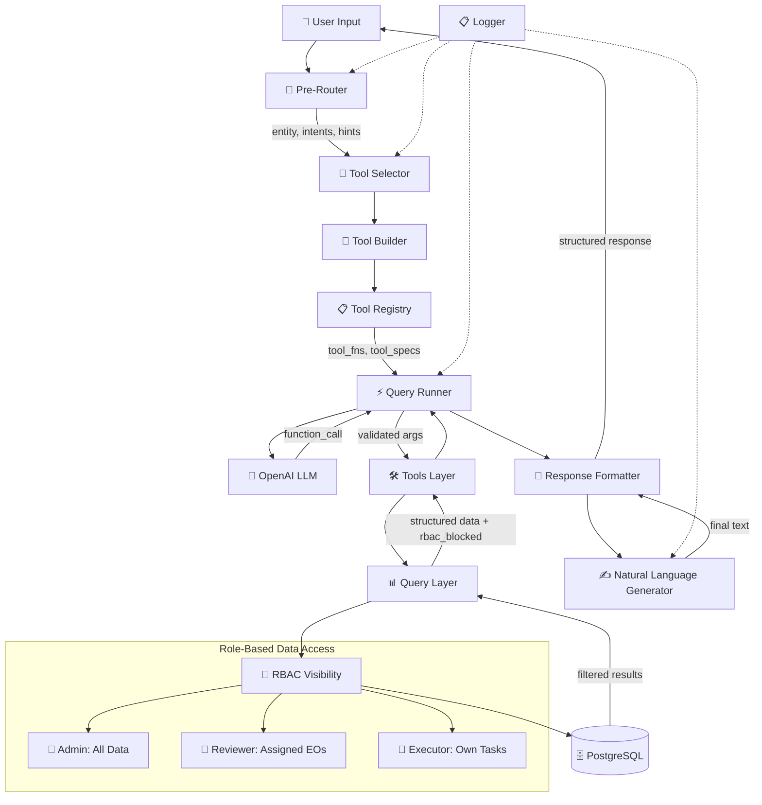

# DOL EO Management Chatbot Architecture

## Overview
A role-based conversational AI system for the DOL Executive Order Management platform. The chatbot enables users to query task data, executive orders, and status updates through natural language while enforcing strict role-based access controls (RBAC).

## System Architecture



## Core Components

### 1. Pre-Router (`src/app/chat/brain/pre_router.py`)
**Purpose**: Classify user intent and extract query hints
- **Input**: Raw user message
- **Output**: `{entity, intents, hints}` (e.g., `{"entity": "tasks", "intents": ["search"], "hints": {"category": "compliance"}}`)
- **Logic**: Heuristic pattern matching + LLM fallback for ambiguous cases

### 2. Tool Selector (`src/app/chat/brain/selector.py`)
**Purpose**: Build minimal, focused toolset for the LLM
- **Input**: Entity + intents from pre-router
- **Output**: Callable functions + OpenAI tool schemas
- **Logic**: Uses tool builder to create role-scoped, safe tool subset

### 3. Tool Registry & Builder (`src/app/chat/toolkit.py`, `tool_builder.py`)
**Purpose**: Dynamic tool registration and generation
- **Registry**: `@register_tool` decorator pattern for auto-discovery
- **Builder**: `build_tools(db, user, entity, intents)` creates validated tool functions
- **Safety**: Pydantic schemas, UUID validation, role-aware filtering

### 4. Query Runner (`src/app/chat/brain/query_runner.py`)
**Purpose**: Single LLM function-calling execution with safety guards
- **Input**: User message + selected tools
- **Output**: Tool result + formatted response
- **Guards**: 
  - UUID validation for ID arguments
  - Target misattribution prevention (non-admin users can't query other users without explicit IDs)
  - NLG-generated error messages for invalid inputs

### 5. Query Layer (`src/db/chat/query/*.py`)
**Purpose**: Read-only, role-scoped database operations
- **Entities**: Tasks, TaskUpdates, ExecutiveOrders, Users, EOPMOAssignments
- **RBAC**: Every query applies `ChatVisibility` filters based on user role
- **Output**: Structured envelopes with `total`, data arrays, and `rbac_blocked` flag

### 6. RBAC Visibility (`src/db/chat/visibility.py`)
**Purpose**: Enforce role-based data access
- **Admin**: Organization-wide visibility
- **Reviewer**: EOs assigned to their PMO + related tasks/updates
- **Executor**: Own assigned tasks + related EO context
- **Implementation**: SQLAlchemy query filters applied at database level

### 7. Response Formatter (`src/app/chat/brain/response_formatter.py`)
**Purpose**: Convert tool results into user-friendly chat responses
- **Input**: Tool name, args, raw result, user role, question
- **Output**: Structured `ChatResponse` (text, data_preview, charts, follow-ups)
- **RBAC**: Detects `rbac_blocked=True` and returns scope-aware messaging

### 8. Natural Language Generator (`src/app/chat/brain/natural_language_generator.py`)
**Purpose**: Always-on LLM text generation for final responses
- **Context**: Role-aware prompts with data summaries
- **Safety**: Strict system prompts prevent speculation beyond provided data
- **Brevity**: Enforced token limits and concise response guidelines

## Security & Safety Features

### RBAC Enforcement Points
1. **Query Level**: All database queries filtered by user role and scope
2. **Runner Level**: Target misattribution guards prevent cross-user data access
3. **Response Level**: Scope-aware messaging when access is denied

### Input Validation
- UUID format validation for all ID parameters
- Pydantic schema validation for tool arguments
- SQL injection prevention via SQLAlchemy bound parameters
- No raw SQL execution - only predefined, safe queries

### Observability
- Comprehensive logging via decorators (`@log_call`, `@log_data_flow`)
- Step-by-step execution traces in `/app/logs/chat/`
- Debug tools for testing user scenarios and RBAC behavior

## Data Flow Example

```
User: "Show me overdue tasks in compliance category"
↓
Pre-Router: {entity: "tasks", intents: ["search"], hints: {category: "compliance", status: "overdue"}}
↓
Selector: [search_tasks, get_my_tasks, aggregate_tasks]
↓
Query Runner: LLM calls search_tasks({category: "compliance", status: "overdue"})
↓
Query Layer: Apply role visibility → Return filtered results
↓
Response Formatter: Generate user-friendly response with NLG
↓
User: "Found 3 overdue compliance tasks. Here are the details..."
```

## Current Capabilities
- ✅ Role-based task, EO, and update queries
- ✅ Natural language aggregations and counts
- ✅ RBAC enforcement at multiple levels
- ✅ UUID validation and misattribution prevention
- ✅ Always-on NLG for human-friendly responses
- ✅ Comprehensive logging and debugging tools

## Testing & Debugging
- `scripts/debug_chat_session.py`: Interactive testing with any user/role
- `scripts/test_rbac_questions.py`: Automated RBAC compliance verification
- `scripts/test_brain_e2e.py`: End-to-end workflow validation

---
*Architecture designed for security, scalability, and maintainability following LLD principles.*
