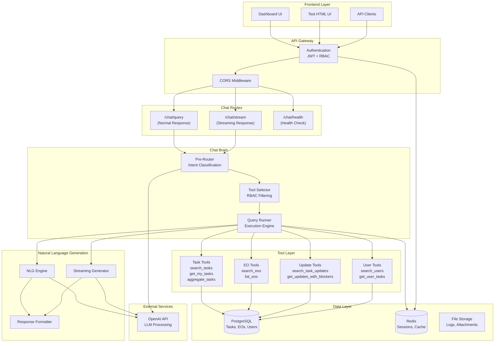

# DOL EO Management Chatbot System
## Intelligent Conversational Interface for Executive Order Management

---

## Executive Summary

The DOL EO Management Chatbot is an advanced conversational AI system that provides role-based access to Executive Order data, task management, and operational insights. Built with modern architecture principles, it combines natural language processing with structured data access to deliver real-time, context-aware responses across different organizational roles.

### Key Features
- **Role-Based Access Control (RBAC)**: Admin, Reviewer, and Executor roles with appropriate data visibility
- **Dual Response Modes**: Normal (complete) and Streaming (real-time) response delivery
- **Natural Language Processing**: Intent classification and entity extraction from user queries
- **Real-Time Streaming**: Token-by-token response delivery for enhanced user experience
- **Comprehensive Tool Suite**: Task management, Executive Order access, and update tracking

---

## System Architecture



---

## How the Chatbot Works

### 1. Request Processing Pipeline

**Authentication & Authorization**
- JWT Bearer token validation with blacklist checking
- User context extraction (role, ID, permissions)
- Role-based access control enforcement

**Intent Classification & Entity Extraction**
- Pre-router analyzes natural language using OpenAI LLM
- Extracts entity types: `tasks`, `executive_orders`, `task_updates`, `users`
- Identifies intents: `search`, `aggregate`, `get_my`, `list`
- Parameter extraction from conversational input

**Tool Selection & Execution**
- Tool selector filters available functions based on user role
- Maps intents to appropriate tool functions with RBAC compliance
- Query runner executes tools with extracted parameters
- Database queries performed with role-based filtering

**Response Generation**
- Natural Language Generator creates human-readable responses
- Two delivery modes:
  - **Normal**: Complete JSON response with metadata
  - **Streaming**: Real-time Server-Sent Events (SSE) with token-by-token delivery

### 2. Role-Based Access Control

| Role | Data Access | Capabilities |
|------|-------------|--------------|
| **Admin** | Full organizational access | All tasks, EOs, updates, aggregate statistics |
| **Reviewer** | Assigned Executive Orders only | Tasks under assigned EOs, related updates |
| **Executor** | Own tasks only | Personal task assignments and updates |

### 3. Available Tools & Capabilities

**Task Management Tools**
- `search_tasks`: Advanced task search with filters
- `get_my_tasks`: User's assigned tasks
- `aggregate_tasks`: Group by category, status, assignee
- `get_nearest_due_task`: Upcoming deadline identification

**Executive Order Tools**
- `search_eos`: EO search with keyword matching
- `list_eos`: Role-filtered EO listing

**Update Tracking Tools**
- `search_task_updates`: Update search with progress filters
- `get_updates_with_blockers`: Identify issues and risks

**User Management Tools**
- `search_users`: Find users by name/email
- `get_user_tasks`: Tasks for specific users (admin only)

---

## API Endpoints & Usage

### Authentication Endpoints
```http
POST /auth/login
Content-Type: application/json
{
  "email": "user@example.com",
  "password": "password"
}
```

### Chat Endpoints

**Normal Response Mode**
```http
POST /chat/query
Authorization: Bearer <jwt_token>
Content-Type: application/json
{
  "message": "Show tasks by category"
}
```

**Streaming Response Mode**
```http
POST /chat/stream
Authorization: Bearer <jwt_token>
Content-Type: application/json
{
  "message": "Show tasks by category"
}
```

### Response Formats

**Normal Response**
```json
{
  "response": "Here is a breakdown of tasks by category...",
  "tool": "aggregate_tasks",
  "args": {"group_by": "category"},
  "data": {"Director of Compliance": 3, "Director of Accounting": 3},
  "processing": ["Signed in as admin.", "Understanding your question..."]
}
```

**Streaming Response (SSE)**
```
data: {"type": "metadata", "tool": "aggregate_tasks", "args": {...}}
data: {"type": "chunk", "content": "Here"}
data: {"type": "chunk", "content": " is"}
data: {"type": "complete", "message": "Stream completed"}
```

---

## Natural Language Processing

### Intent Recognition Examples
- "Show tasks by category" → `aggregate_tasks` with `group_by: category`
- "List updates with blockers" → `search_task_updates` with `has_blockers: true`
- "Show my tasks" → `get_my_tasks`
- "Find tasks assigned to John" → `search_tasks` with `assignee_name: John`

### Entity Extraction
- Automatic detection of user names, task IDs, EO references
- Parameter extraction from natural language
- Context-aware filtering based on user role
- Intelligent fallback for ambiguous queries

### Response Generation
- Role-appropriate language and detail level
- Structured data presentation with actionable insights
- Error handling with helpful suggestions
- Professional tone adapted to user context

---

## Security & Performance

### Security Features
- **JWT Authentication**: Secure token-based authentication with expiration
- **Token Blacklisting**: Immediate revocation of compromised tokens
- **Role-Based Access**: Granular data access control
- **Input Validation**: Comprehensive sanitization and validation
- **CORS Protection**: Secure cross-origin request handling
- **SQL Injection Prevention**: Parameterized queries throughout

### Performance Optimizations
- **Streaming Responses**: Real-time delivery for enhanced UX
- **Redis Caching**: Session management and response caching
- **Database Indexing**: Optimized queries for fast responses
- **Async Processing**: Non-blocking I/O operations
- **Load Balancing**: Horizontal scaling readiness

---

## Testing & Development

### Test UI
- **Location**: `scripts/chat_test_ui.html`
- **Features**: Real-time streaming demo, mode switching, authentication testing
- **Access**: `http://localhost:8080/chat_test_ui.html`

### API Testing
- **Postman Collection**: Pre-configured requests for all endpoints
- **Authentication Flow**: Complete login/logout testing
- **Both Modes**: Streaming and normal response testing

### RBAC Testing
- **Automated Suite**: Role-based access validation
- **Permission Boundaries**: Data visibility verification
- **Script**: `scripts/test_rbac_questions.py`

---

## Future Enhancements

### Planned Features
- **Conversation Memory**: Multi-turn conversation support
- **Advanced Analytics**: Trend analysis and predictive insights
- **Integration APIs**: Third-party system connections
- **Mobile Interface**: Native mobile application
- **Voice Interface**: Speech-to-text integration

### Scalability Roadmap
- **Microservices**: Service decomposition for better scaling
- **Event Streaming**: Real-time data updates
- **Advanced Caching**: Multi-layer caching strategy
- **API Gateway**: Centralized request routing and management

---

*This documentation provides a comprehensive overview of the DOL EO Management Chatbot system. For technical implementation details, refer to the source code and API documentation.*
